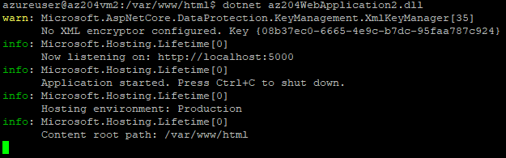

# Deploy .NET CORE 3.1 solution to Linux VM

## Create the .NET Core 3.1 App

Start by creating a new .NET Core 3.1 console application in Visual Studio

Open `Startup.cs` and add:

```C#
using Microsoft.AspNetCore.HttpOverrides;
```

Then change the `Configure` method as follows:

```C#
public void Configure(IApplicationBuilder app, IWebHostEnvironment env)
{
    app.UseStaticFiles();
    app.UseForwardedHeaders(new ForwardedHeadersOptions
    {
        ForwardedHeaders = ForwardedHeaders.XForwardedFor | ForwardedHeaders.XForwardedProto
    });

    if (env.IsDevelopment())
    {
        app.UseDeveloperExceptionPage();
    }
    else
    {
        app.UseExceptionHandler("/Error");
    }

    app.UseStaticFiles();

    app.UseRouting();

    app.UseAuthorization();

    app.UseEndpoints(endpoints =>
    {
        endpoints.MapRazorPages();
    });
}
```

Now open `Program.cs` and in the `IHostBuilder` class change it to:

```C#
public static IHostBuilder CreateHostBuilder(string[] args) =>
    Host.CreateDefaultBuilder(args)
        .ConfigureWebHostDefaults(webBuilder =>
        {
            webBuilder.UseStartup<Startup>();
            webBuilder.UseStaticWebAssets();    
        });
```

Then open `launchSettings.json` and change the `applicationUrl` to "http://localhost:5000"

locally publish the app by changing directory to the app root and typing

```cmd
dotnet publish
```

This creates a folder with the built app ready to be published to `<approot>\bin\debug\netcoreapp3.1\publish`

## Configure the Linux VM

Connect to the Linux VM via SSH and run the following commands to install nginx

```bash
sudo apt-get update
sudo apt-get install -y nginx
```

Then set the permissions of the nginx content (html) directory so the app can be deployed to it.

```bash
cd /var/www
sudo chmod 667 html
```

Install the .NET Core 3.1 SDK onto the server

```bash
wget https://packages.microsoft.com/config/ubuntu/18.04/packages-microsoft-prod.deb -O packages-microsoft-prod.deb
sudo dpkg -i packages-microsoft-prod.deb
sudo apt-get update
sudo apt-get install apt-transport-https
sudo apt-get update
sudo apt-get install -y dotnet-sdk-3.1
```

## Copy the Published App to VM via WinSCP

Open WinSCP and connect via SFTP to the Linux VM. 

Then browse to local directory of the `publish` folder and the remote directory of `/var/www/html/`

Copy the content of the publish directory to the remote html directory.

## Configure nginx

Ensure nginx proxies requests to port 5000

Change the permissions of the `default` file

```bash
cd /etc/nginx/sites-available
sudo chmod 667 default
```

In WinSCP or VIM open the `/etc/nginx/sites-available/default` and paste in the following under `location / {`

```terminal
# First attempt to serve request as file, then
# as directory, then fall back to displaying a 404.
try_files $uri $uri/ =404;
proxy_pass http://localhost:5000;
proxy_http_version 1.1;
proxy_set_header Upgrade $http_upgrade;
proxy_set_header Connection keep-alive;
proxy_set_header Host $host;
proxy_cache_bypass $http_upgrade;
```

Reload nginx

```bash
sudo nginx -s reload
```

## Run the App on the Server

```bash
cd /var/www/html
dotnet az204WebApplication2.dll
```

You can see it is running on port 5000

