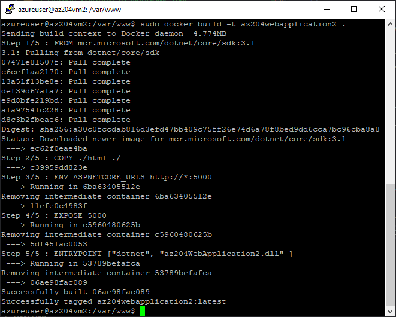

# Containerise the .NET CORE App

Create a docker file and copy it via WinSCP to the `/var/www/` directory

```dockerfile
FROM mcr.microsoft.com/dotnet/core/sdk:3.1
COPY ./html ./
ENV ASPNETCORE_URLS http://*:5000
EXPOSE 5000
ENTRYPOINT ["dotnet", "az204WebApplication2.dll" ]
```

if you get access denied, change the permissions on the www folder

```bash
cd /var
sudo chmod 667 www
```

Build the docker image

```bash
cd /var/www

sudo docker build -t az204webapplication2 .
```



Run the container interactively, remove it once stopped, and expose local port 5000 to port 5000 on the container.

```bash
sudo docker run -it --rm -p 5000:5000 --name az204webapplication2-instance az204webapplication2
```

