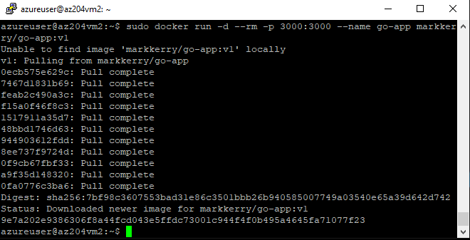
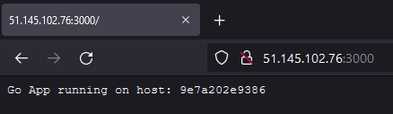

# Develop Azure compute solutions

## 1-Deploy-Solution-to-Windows-VM

The solution is an ASP.NET app deployed from Visual Studio.

* Assign a DNS name to the VM
* Enable RDP in the NSG
* Install the Web Deploy tool
* Publish an ASP.NET app to the VM from Visual Studio

## 2-Deploy-Container-to-Linux-VM

Here I have created an Ubuntu VM, installed Docker, exposed port 300 and installed my go-app container.

* Create the VM and NSG rules.
* Install docker over SSH
* Install and connect to the docker container

## 3-Deploy-Solution-to-Linux-VM

Using the same Ubuntu VM above, I will install nginx and deploy a .NET CORE app via WinSCP.

* Create a .NET CORE 3.1 app
* Install nginx on the Ubuntu VM
* Configure nginx and permissions on the VM
* Deploy the web app to the VM
