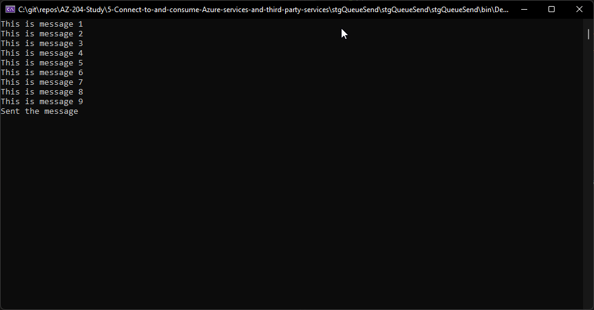
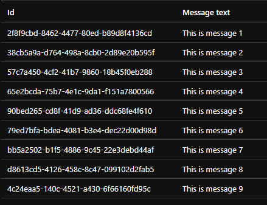
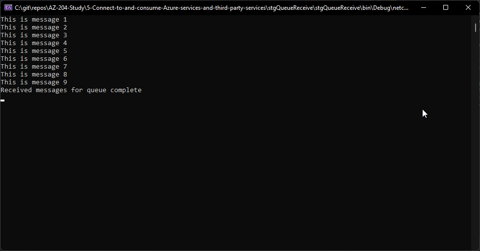
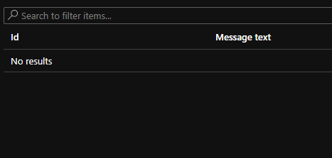

# Connect to and consume Azure services and third-party services

## Azure Storage Queue with .NET

### stgQueueSend

Here a C# program is sending messages to an Azure Storage Queue.

You can see the message in the queue.

### stgQueueReceive

Here another C# program us receiving and deleting the messages from the Azure Storage Queue.

You can see the messages have been deleted from the queue.

